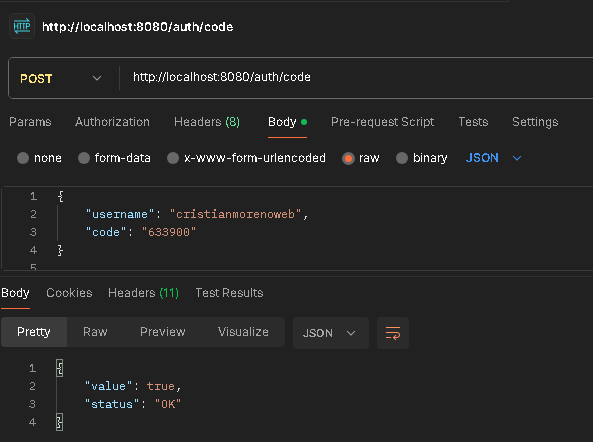

# Spring Boot with MFA Authentication

### Intrduction
This project uses Multifactor Authentication with <b>Google Authenticator</b> to authenticate user. User provider your credentials, next, the QR Code is generate where the user need will should scan QR Code and write the 6 digits that provide the application.

### CI / CD

The workflows in Github Actions will compile and build the application. Once that application is are running, will close after 5 seconds to continue workflow. 


### Code Persistence

At the moment that code is generate, the entity UserTOTP is saved in the repository. 

```java
@Service
public class GoogleCredentialsRepository implements ICredentialRepository {

    private final Map<String, UserTOTP> usersCode = new HashMap<String, UserTOTP>();

    @Autowired
    private GoogleAuthenticatorRepositoryService googleAuthenticatorRepositoryService;

    @Override
    public String getSecretKey(String userName) {
        Optional<UserTOTP> result = googleAuthenticatorRepositoryService.findByUsername(userName);

        if (result.isEmpty()) {
            throw new UsernameNotFoundException("Username TOTP not found");
        }

        UserTOTP userTOTP = result.get();
        return userTOTP.getSecretKey();
    }

    @Override
    public void saveUserCredentials(String userName, String secretKey, int validationCode, List<Integer> scratchCodes) {
        UserTOTP userTOTP = new UserTOTP();
        userTOTP.setUsername(userName);
        userTOTP.setSecretKey(secretKey);
        userTOTP.setScratchCodes(scratchCodes);
        
        googleAuthenticatorRepositoryService.save(userTOTP);
    }
    
    public UserTOTP getUser(String username) {

        return usersCode.get(username);
    }
}
```


### Technologies

The technologies used in this project are:

* Spring Boot
* Spring Security
* Spring AOP
* Spring Data JPA
* Google Authenticator
* PostgreSQL
* JWK (Json Wek Keys)

### Authenticator Management

The authentication proccess is magamenent to <b>AuthenticationManager</b> and <b>AuthenticationProvider</b>, where, the first act how mediator between the application and the client and the second act how credentials manager.

### For example



6 digit code is generate and that will expire after 30 seconds, this digit will to appear in <b>Google Authenticator APP</b> above this shape:


